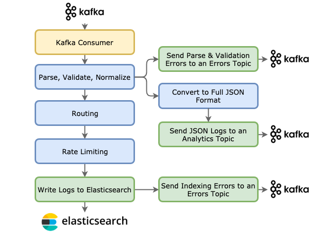

# firebolt   
A golang framework for streaming event processing & data pipeline apps

## Introduction
Firebolt has a simple model intended to make it easier to write reliable pipeline applications that process a stream of data.

It can be used to build systems such as:
* logging/observability pipelines
* streaming ETL
* event processing pipelines

Every application's pipeline starts with a single **source**, the component that receives events from some external system.  Sources 
must implement the `node.Source` interface.

We provide one built-in source:

 * **kafkaconsumer** - Events come from a Kafka topic, and are passed to the root nodes as `[]byte`

The processing of your application is executed by its **nodes** which form a processing tree.  Data - events - flow down
this tree.   A parent **node** passes results down to it's child **nodes**.  Nodes may process events synchronously or
asynchronously, and must implement the `node.SyncNode` or `node.AsyncNode` interfaces accordingly.

We provide two built-in node types:

 * **kafkaproducer** - Events are produced onto a kafka topic by an asynchronous producer.
 * **elasticsearch** - Events are bulk indexed into Elasticsearch.

## Example: Logging Pipeline
At DigitalOcean, our first use of Firebolt was in our logging pipeline. This pipeline consumes logs from just about
every system we run.   The diagram below depicts the source and nodes in this application.

This system uses the built-in `kafkaconsumer` source (in yellow) and `kafkaproducer` and `elasticsearch` nodes (in green).
The blue nodes are custom to this application.

      

## What does Firebolt do for me?

Firebolt is intended to address a number of concerns that are common to near-realtime data pipeline applications, making it easy
to run a clustered application that scales predictably to handle large data volume.

It is not an analytics tool - it does not provide an easy way to support 'wide operations' like record grouping, windowing, 
or sorting that require shuffling data within the cluster.   Firebolt is for 'straight through' processing pipelines that are
not sensitive to the order in which events are processed.

Some of the concerns Firebolt addresses include:
 * **kafka sources** Minimal configuration and no code required to consume from a Kafka topic, consumer lag metrics included
 * **kafka sinks** Same for producing to a Kafka topic
 * **loose coupling** Nodes in the pipeline are loosely coupled, making them easily testable and highly reusable
 * **simple stream filtering** Filter the stream by returning `nil` in your nodes
 * **convenient error handling** Send events that fail processing to a kafka topic for recovery or analysis with a few lines of config 
 * **outage recovery: offset management** Configurable Kafka offset management during recovery lets you determine the maximum "catch up" to attempt after an outage, so you can quickly get back to realtime processing.
 * **outage recovery: parallel recovery** After an outage, process realtime data and "fill-in" the outage time window in parallel, with a rate limit on the recovery window.
 * **monitorability** Firebolt exposes Prometheus metrics to track the performance of your Source and all Nodes without writing code.  Your nodes can expose their own custom internal metrics as needed.
 * **leader election** Firebolt uses Zookeeper to conduct leader elections, facilitating any processing that may need to be conducted on one-and-only-one instance.

## Documentation

1. [Configuration ](docs/config.md) The configuration file format

1. [Execution ](docs/executor.md) How Firebolt processes your data

1. [Registry ](docs/registry.md) Adding node types to the registry

1. [Sample Application Code ](docs/application.md)  Example code for running the Firebolt executor

1. [Sources ](docs/sources.md) Implementing and using sources

1. [Sync Nodes ](docs/sync-nodes.md) Implementing and using synchronous nodes

1. [Async Nodes ](docs/async-nodes.md) Implementing and using asynchronous nodes

1. [Leader Election ](docs/leader-election.md) Starting leader election and accessing election results

1. [Messaging ](docs/messaging.md) How to send and receive messages between the components of your system

1. [Metrics](docs/metrics.md) What metrics are exposed by default, and how to add custom metrics to your nodes

## Built-In Types

1. [Kafka Producer ](docs/node-kafkaproducer.md) Node for producing events onto a Kafka topic

1. [Elasticsearch ](docs/node-elasticsearch.md) Node for indexing documents to an Elasticsearch cluster
